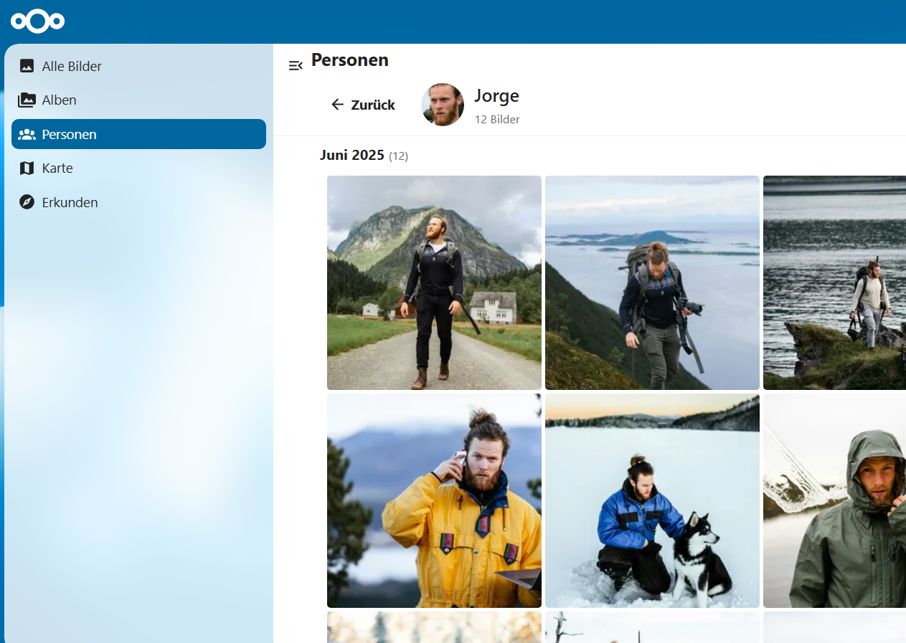

# Immich Integration for Nextcloud

> Browse your [Immich](https://immich.app) photo library directly inside Nextcloud — timeline, albums, people, map and more.



---

## Features

| Feature | Description |
| --- | --- |
| **Timeline** | Lazy-loaded photo & video timeline, grouped by date |
| **Albums** | Browse all your Immich albums with cover thumbnails |
| **People** | Face recognition — explore photos by person |
| **Map** | Interactive map of all geotagged photos |
| **Explore** | Browse by location and category |
| **Lightbox** | Full-screen viewer with keyboard navigation, EXIF metadata panel |
| **Select & Save** | Select photos and videos across views and save originals directly to your Nextcloud Files |
| **Upload** | Send files from Nextcloud Files directly to Immich |
| **Admin Settings** | Configure server URL and API key |

---

## Requirements

- **Nextcloud** 30 or newer
- **PHP** 8.1 or newer
- A running [Immich](https://immich.app) instance

---

## Installation

```bash
cd /path/to/nextcloud/custom_apps
git clone https://github.com/xXRoxXeRXx/integration_immich
cd integration_immich
npm ci && npm run build
occ app:enable integration_immich
```

---

## Configuration

1. Open **Nextcloud → Admin Settings → Immich Integration**
2. Enter your **Immich server URL** (e.g. `https://photos.example.com`)
3. Enter your **API key** — found in Immich under *Account Settings → API Keys*
4. Save — the Immich entry appears in the top navigation

---

## Development

```bash
npm install
npm run dev      # development build
npm run watch    # watch mode
npm run build    # production build
```

---

## License

[AGPL-3.0-or-later](COPYING)
