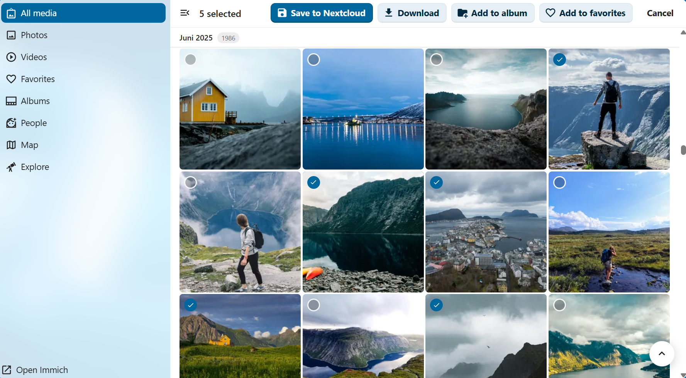
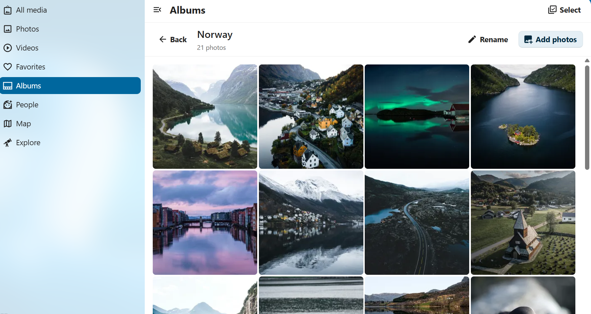
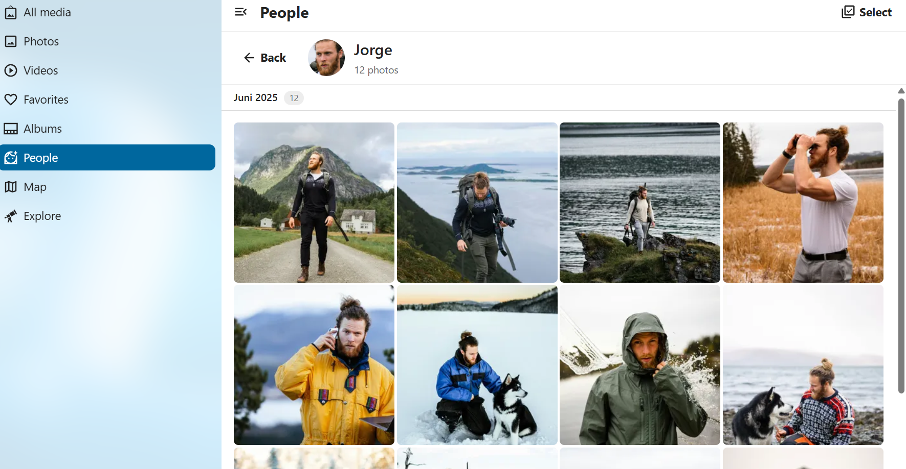

<div align="center">


# Immich Integration for Nextcloud

**Browse your [Immich](https://immich.app) photo library directly inside Nextcloud.**  
Timeline, albums, people, map, explore — all seamlessly integrated.

[](COPYING)
[](https://nextcloud.com)
[](https://immich.app)

</div>

---

## 📸 Screenshots

<table>
  <tr>
    <td align="center"><strong>Timeline</strong></td>
    <td align="center"><strong>Albums</strong></td>
    <td align="center"><strong>People</strong></td>
  </tr>
  <tr>
    <td></td>
    <td></td>
    <td></td>
  </tr>
</table>

---

## ✨ Features

| Feature | Description |
| --- | --- |
| 🖼️ **Timeline** | Lazy-loaded photo & video timeline, grouped by date with smooth infinite scroll |
| 📁 **Albums** | Browse all your Immich albums with cover thumbnails, create, rename and delete albums |
| 👤 **People** | Face recognition — explore your library by recognized person |
| 🗺️ **Map** | Interactive map of all geotagged photos with cluster markers |
| 🔍 **Explore** | Browse by city, country, state, object or tag |
| 🔎 **Lightbox** | Full-screen viewer with keyboard navigation, pinch-to-zoom and EXIF metadata panel |
| ⭐ **Favorites** | Mark and unmark photos as favorites directly from Nextcloud |
| �️ **Delete** | Delete files from Immich (moved to trash if enabled) via lightbox or selection menu |
| �💾 **Save to Nextcloud** | Select photos and videos and save the originals directly to your Nextcloud Files |
| ⬆️ **Upload to Immich** | Send photos and videos from Nextcloud Files to Immich via the file action menu |
| ☑️ **Multi-select** | Select multiple assets across any view for batch operations |
| 🌍 **Translations** | German, French, Spanish, Dutch and Portuguese included |
| ⚙️ **Admin Settings** | Configure Immich server URL and API key per user |

---

## 🔧 Requirements

- **Nextcloud** 27 or newer
- **PHP** 8.2 or newer
- A running [Immich](https://immich.app) instance (with API access enabled)

---

## 🚀 Installation

### Via Nextcloud App Store *(recommended)*

1. Open **Nextcloud → Apps → Search** for `Immich Integration`
2. Click **Install**

### Via Release Tarball (manual)

1. Download `integration_immich.tar.gz` from the [latest release](https://github.com/xXRoxXeRXx/integration_immich/releases/latest)
2. Extract into your Nextcloud `apps/` directory:
   ```bash
   tar -xzf integration_immich.tar.gz -C /path/to/nextcloud/apps/
   ```
3. Enable the app:
   ```bash
   php occ app:enable integration_immich
   ```

---

## ⚙️ Configuration

1. Open **Nextcloud → Personal Settings → Immich Integration**
2. Enter your **Immich server URL** (e.g. `https://photos.example.com`)
3. Enter your **API key** — found in Immich under *Account Settings → API Keys*
4. Click **Test connection** to verify, then **Save**
5. The **Immich** entry now appears in the Nextcloud top navigation

### 🔑 Required Immich API Key Permissions

When creating an API key in Immich (*Account Settings → API Keys → New API key*), the following permissions are required:

| Permission | Used for |
| --- | --- |
| `asset.view` | Thumbnails and video streaming |
| `asset.read` | Timeline, asset details, EXIF metadata |
| `asset.update` | Mark / unmark favorites |
| `asset.upload` | Upload files from Nextcloud to Immich |
| `asset.download` | Download originals and archives to Nextcloud |
| `asset.delete` | Delete assets from Immich (moves to trash if enabled) |
| `album.read` | List all albums and album contents |
| `album.create` | Create new albums |
| `album.update` | Rename albums |
| `album.delete` | Delete albums |
| `albumAsset.create` | Add assets to albums |
| `albumAsset.delete` | Remove assets from albums |
| `person.read` | List recognized people and their thumbnails |
| `map.read` | Load map markers for the Map view |

> **Tip:** Immich lets you create multiple API keys with different scopes. Creating a dedicated key for the Nextcloud integration (with only the permissions above) is recommended over using a full-access key.
>
> The connection validation on the settings page (`POST /auth/validateToken`) does not require any additional permission — it works with any valid API key.

---

## 🛠️ Development

```bash
npm install
npm run dev      # development build (unminified)
npm run watch    # watch mode with hot rebuild
npm run build    # production build
```

The app uses **Vue 3** + **Pinia** for state management and the official `@nextcloud/*` component libraries.

---

## 🤝 Contributing

Pull requests and bug reports are welcome!  
Please open an [issue](https://github.com/xXRoxXeRXx/integration_immich/issues) for feature requests or bug reports.

---

## 📄 License

This project is licensed under the [AGPL-3.0-or-later](COPYING) license.
